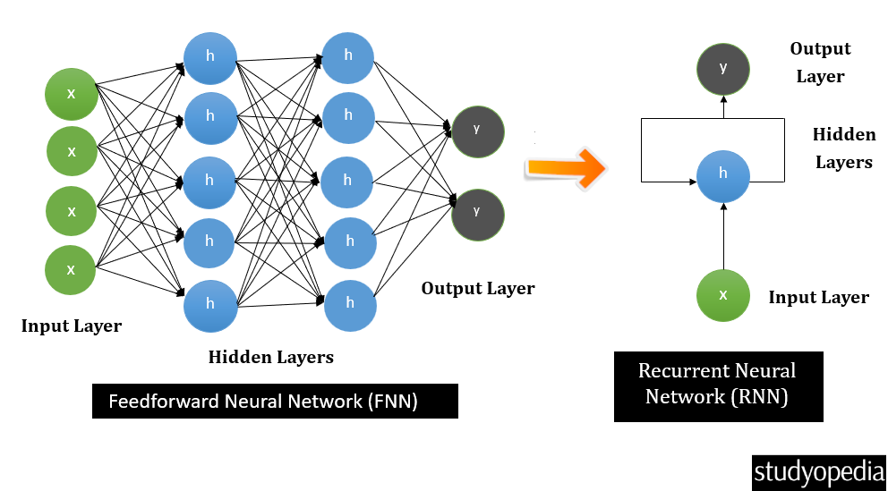
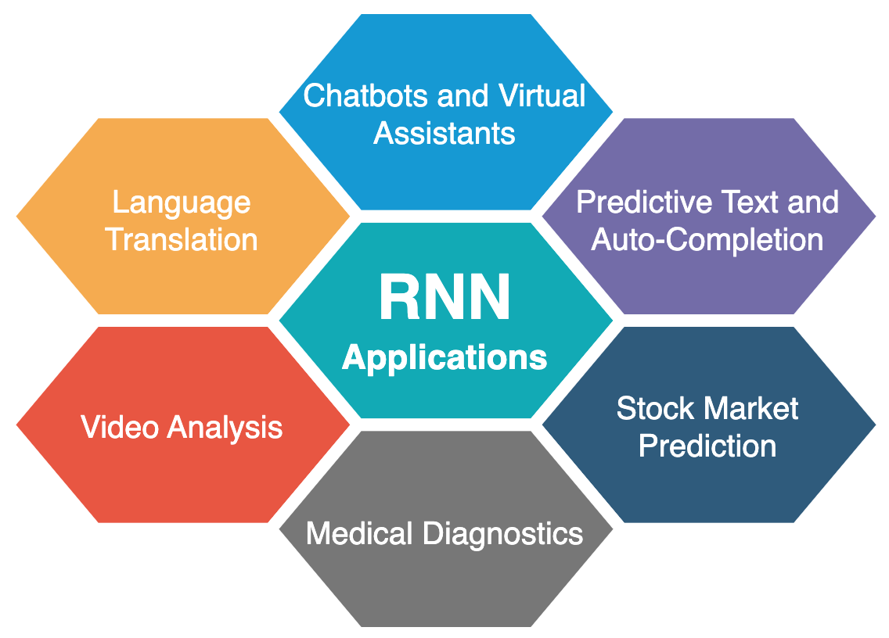
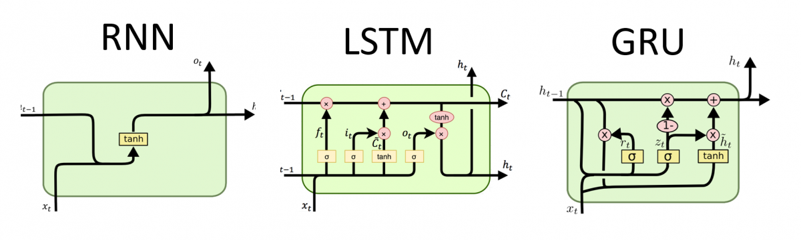

# Understanding Recurrent Neural Networks (RNNs) — A Beginner’s Guide

Recurrent neural networks (RNNs) are a type of deep learning model designed to handle sequential data where the order of elements matters, such as sentences, time series, or audio waveforms. They are widely used for tasks like language modeling, speech recognition, and time series prediction, because they can

- [Understanding Recurrent Neural Networks (RNNs) — A Beginner’s Guide](#understanding-recurrent-neural-networks-rnns--a-beginners-guide)
  - [What Is an RNN?](#what-is-an-rnn)
  - [Architecture and Working Principle](#architecture-and-working-principle)
  - [RNN Unfolding / Unrolling](#rnn-unfolding--unrolling)
  - [Why Use RNNs? (vs Other Neural Networks)](#why-use-rnns-vs-other-neural-networks)
  - [Training RNNs: Backpropagation Through Time (BPTT)](#training-rnns-backpropagation-through-time-bptt)
  - [Challenges of Standard RNNs](#challenges-of-standard-rnns)
    - [RNN Variants](#rnn-variants)
  - [Summary](#summary)
  - [conlcusion](#conlcusion)

## What Is an RNN?
An RNN is a neural network architecture tailored for sequential data. Unlike standard neural networks that treat each input as independent, RNNs have a built-in memory mechanism. They process data one element at a time—reminding the network what it has seen before. At each time step, the RNN keeps track of a hidden state that stores information about previous inputs.

**Simple analogy**: Imagine reading a sentence and trying to predict the next word. You don’t rely only on the current word—you remember the words that came before. RNNs do the same: they “remember” prior inputs, which helps them understand context and make better predictions.

## Architecture and Working Principle

A standard RNN contains:
* **Input layer**: Receives sequential data.
* **Hidden layer(s)**: Maintains a hidden state—a sort of short-term memory.
* **Output layer**: Produces predictions (one per time step).

At each time step t

* The RNN takes the current input xt and the previous hidden state  h t−1

* It computes a new hidden state using
`h 
t
 =f(W⋅x 
t
 +U⋅h 
t−1
 +b)`
where W,U,b are weights and biases, and f is an activation function (often tanh, sigmoid, or ReLU).

* The hidden state is passed to the next time step and can also be used to produce an output.

**Key property**: The hidden state lets RNNs “remember” previous steps—influencing current output based on historic context.

## RNN Unfolding / Unrolling
RNNs can be unfolded across time to reveal how data flows through the network. At each time step, the RNN applies the same weights, sharing parameters, and connects the output of each step as input to the next. Imagine each step in a sequence as a layer in a single chain—all linked together, passing information forward in time.

## Why Use RNNs? (vs Other Neural Networks)
* **Traditional Neural Networks** (e.g., Feedforward, CNNs): Work best for fixed-size inputs and outputs; struggle with sequential data (like sentences and time series) because they don't handle variable lengths or order dependencies well.

* **RNNs**: Build "memory" of previous items, understand context, and adapt to input/output length.

**Example Applications**:

* Text generation (predicting next word)
* Speech recognition
* Translation
* Stock price prediction
* Sensor data analysis

RNNs were once dominant for sequential tasks, but recently, newer models (like Transformers) have become popular. Still, RNNs remain essential in understanding deep learning for sequences.

## Training RNNs: Backpropagation Through Time (BPTT)
Unlike standard networks, RNNs use a technique called backpropagation through time (BPTT). Instead of treating each step independently, BPTT unfolds the RNN across time and applies standard backpropagation to update weights—accounting for how each time step influences later outputs.

## Challenges of Standard RNNs
* **Vanishing/Exploding Gradients**: When sequences get long, the gradients can shrink (vanish) or grow (explode), making learning difficult—especially for long-term dependencies.
* **Difficulty with Long-term Memory**: Basic RNNs perform well for short dependencies (e.g., a few words), but struggle to remember information from far-back steps (e.g., earlier sentences).

### RNN Variants

To address the limitations of standard RNNs, several variants exist:
**Bidirectional RNN (BRNN):** Processes sequences in both directions (forward & backward) for richer context.
**Long Short-Term Memory (LSTM)**: Adds gates to selectively save or discard information, helping capture long-term dependencies.
**Gated Recurrent Unit (GRU)**: Similar to LSTM but simpler, combines “forget” and “update” mechanisms.
**Encoder-Decoder RNNs**: Used for transforming one sequence into another (e.g., language translation).
Each variant builds on the standard RNN design to help with memory and stability as sequences grow long.

## Summary
Concept | Description
--------|------------
RNN | Neural network designed for sequential data
Memory | Stores information from previous inputs
Training | Uses Backpropagation Through Time (BPTT)
Problem | Struggles with long sequences (vanishing gradient)
Improvement | LSTM and GRU architectures
Modern Use | Foundation for sequence-based models like Transformers

* RNNs are neural networks for sequential data, equipped with memory of previous steps.
* They differ from traditional networks by sharing weights across time and using hidden states to track dependencies.
* Standard RNNs struggle with very long sequences, so advanced variants (LSTM, GRU) were developed.
* Typical applications include text, speech, and time series tasks where context and order matter.

## conlcusion
Recurrent Neural Networks (RNN) represent a key milestone in the evolution of deep learning. They taught machines to remember, making breakthroughs in natural language processing and speech recognition possible.
Even though Transformers have taken the lead, understanding RNNs gives you a strong foundation for grasping how modern AI handles sequences and context is a crucial concept in deep learning.